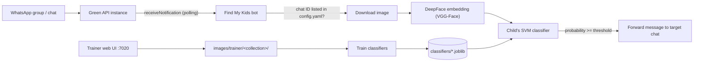

# Find My Kids - WhatsApp Face Recognition Bot

[](https://hub.docker.com/r/techblog/find-my-kids)
[](LICENSE)

Find My Kids is a self-hosted WhatsApp bot that watches the groups and chats you choose (for example, a kindergarten or school class group), runs face recognition on every image posted there, and forwards the images in which your child appears to a chat of your choice. It is built for parents who are tired of scrolling through hundreds of group photos to find the few that include their own kids.

Face recognition runs **locally** with [DeepFace](https://github.com/serengil/deepface) and scikit-learn. No cloud face-recognition service is used; WhatsApp access goes through the [Green API](https://green-api.com/).

## Table of Contents

- [Features](#features)
- [Components](#components)
- [How It Works](#how-it-works)
- [Prerequisites](#prerequisites)
- [Setup Instructions](#setup-instructions)
- [Configuration Reference](#configuration-reference)
- [Usage](#usage)
- [API Reference](#api-reference)
- [Privacy and Security](#privacy-and-security)
- [Troubleshooting](#troubleshooting)
- [Development](#development)
- [Contributing](#contributing)
- [License](#license)

## Features

- Monitors one or more WhatsApp groups or contacts per child, as defined in `config.yaml`.
- Local face recognition: DeepFace (VGG-Face model, OpenCV detector) creates face embeddings, and a per-child scikit-learn SVM classifier decides whether the child appears.
- Forwards matching images (the original WhatsApp message) to a target group or contact.
- Web UI to upload training images, browse the training gallery, and re-train the model.
- Bulk training by dropping images into per-child folders.
- Web page that lists your WhatsApp contacts and groups with their chat IDs, to help you fill in the config file.
- Adjustable match threshold (`PROBABILITY_THRESHOLD`, see the known issue under [Environment variables](#environment-variables)).
- Docker image for `linux/amd64` and `linux/arm64` (the build workflow also targets `armhf`, so the platform list may change with the next publish).

## Components

This solution leverages the following technologies:

- **[Green API](https://green-api.com/):** Facilitates WhatsApp communication (via the [`whatsapp-chatbot-python`](https://github.com/green-api/whatsapp-chatbot-python) library).
- **[DeepFace](https://github.com/serengil/deepface):** Detects faces and extracts face embeddings (VGG-Face model).
- **[scikit-learn](https://scikit-learn.org/):** Trains one linear SVM classifier per child on those embeddings.
- **[FastAPI](https://fastapi.tiangolo.com/):** Powers the web interface and API.

## How It Works



1. The bot polls the Green API notification queue for **incoming** messages. This is why the instance must not have a webhook URL configured (see below).
2. When an image arrives from a chat ID listed under a child in `config.yaml`, the bot downloads it to `images/downloaded/`.
3. DeepFace extracts a face embedding from the image, and the child's classifier (`classifiers/<collection_id>_classifier.joblib`) predicts whether it is that child.
4. If it is a match and the probability is at least `PROBABILITY_THRESHOLD`, the original message is forwarded to the `target` chat.
5. The downloaded image is deleted after a successful check. If the check fails with an error, the image stays in `images/downloaded/`.

Training reads every sub-folder of `images/trainer/` (one folder per child), extracts one embedding per image, and trains a one-vs-all classifier for each folder. The images of the other children are the negative examples.

> **Note:** Only the **first** face DeepFace detects in an image is used, both when training and when checking incoming images. Group photos in which the child is not the first detected face may be missed. For training, use images that show only the child's face.

## Prerequisites

Before proceeding with the setup, ensure that you have the following:

- [Docker and Docker Compose installed](https://medium.com/@tomer.klein/step-by-step-tutorial-installing-docker-and-docker-compose-on-ubuntu-a98a1b7aaed0)
- A registered [Green API account](https://green-api.com/) with an instance linked to a WhatsApp account that is a member of the groups you want to monitor
- Training images for **at least two** people (see [Training](#training))

No AWS account or other cloud service is required.

## Setup Instructions

### 1. Green API Configuration

#### Account Registration

1. Visit [https://green-api.com/en](https://green-api.com/en) and register for a new account.
2. Complete the registration form by entering your details, and then click **Register**.

   
   

3. Once registered, select **Create an instance**.

   

4. Choose the **Developer** instance (Free Tier).

   

5. Copy the generated Instance ID and Token. You will need them for the integration.

   

6. To link your WhatsApp account, navigate to the API section on the left under **Account** and select **QR**. Open the provided QR URL in your browser, then click **Scan QR code**:

   
   

7. Scan the QR code to complete the linking process:

   

8. Once linked, the instance status will display a green light, indicating it is active:

   

> **Important:** Do not configure a webhook URL for your instance. The bot reads incoming messages from the Green API notification queue, and Green API does not deliver notifications to that queue while a webhook URL is set.
>
> 

On startup, the bot enables incoming and outgoing message notifications on the instance if all of them are disabled, and it clears any notifications that were already waiting in the queue.

### 2. Environment Configuration

1. Duplicate the sample environment file by running:

   ```bash
   cp .env.example .env
   ```

2. Edit the `.env` file with your credentials:

   ```
   # WhatsApp API Credentials
   GREEN_API_INSTANCE=your_whatsapp_instance_id
   GREEN_API_TOKEN=your_whatsapp_api_token
   ```

### 3. Running the Application

1. Use the following `docker-compose.yaml` (the same file is included in this repository):

   ```yaml
   services:
     find-my-kids:
       container_name: find-my-kids
       image: techblog/find-my-kids:latest
       ports:
         - "7020:7020"
       environment:
         - GREEN_API_INSTANCE=${GREEN_API_INSTANCE}
         - GREEN_API_TOKEN=${GREEN_API_TOKEN}
         - PROBABILITY_THRESHOLD=0.5
       volumes:
         - ./find-my-kids/images:/app/images
         - ./find-my-kids/config:/app/config
         - ./find-my-kids/classifiers:/app/classifiers
       restart: unless-stopped
   ```

   Where:
   - `./find-my-kids/images` holds the training images (`trainer/`) and the temporarily downloaded images (`downloaded/`).
   - `./find-my-kids/config` holds `config.yaml`. A sample file is copied there on the first start.
   - `./find-my-kids/classifiers` holds the trained classifiers, so you don't have to re-train after the container is recreated.

2. Start the application:

   ```bash
   docker compose up -d
   ```

3. The web interface listens on port `7020`:
   - Trainer: `http://[SERVER_IP]:7020/trainer`
   - Contacts and groups: `http://[SERVER_IP]:7020/contacts`

#### Docker image

The image is published on Docker Hub as [`techblog/find-my-kids`](https://hub.docker.com/r/techblog/find-my-kids) for `linux/amd64` and `linux/arm64`.

> **Note:** At the time of writing, the `latest` tag on Docker Hub was built on 2025-04-14 and predates some later changes in this repository. Most notably, it hard-codes the threshold to `0.5` and ignores `PROBABILITY_THRESHOLD`.
>
> **Warning:** An image built from the current source cannot detect faces. Every detection fails because of the `PROBABILITY_THRESHOLD` issue described under [Environment variables](#environment-variables). Use the Docker Hub image until this is fixed.

The `Dockerfile` declares `EXPOSE 80`, but the application listens on port `7020`. Publish port `7020` as in the compose file above.

## Configuration Reference

### Environment variables

| Variable | Required | Default | Description |
|----------|----------|---------|-------------|
| `GREEN_API_INSTANCE` | Yes | - | Green API instance ID. |
| `GREEN_API_TOKEN` | Yes | - | Green API instance token. |
| `PROBABILITY_THRESHOLD` | No | `0.5` | Minimum classifier probability for an image to count as a match. Ignored by the current Docker Hub `latest` image, which always uses `0.5`. See the known issue below. |

> **Known issue (current source):** When `PROBABILITY_THRESHOLD` is set, the code keeps it as a string and compares it to a number (`app/kidfinder.py`), which raises an error. The `Dockerfile` always sets `ENV PROBABILITY_THRESHOLD=` (empty), so every detection in an image built from the current source fails. The `0.5` default applies only to a local run with the variable unset. After such an error, the bot keeps retrying the same message and stops processing new ones (see [Troubleshooting](#troubleshooting)).
>
> Because the classifier makes a yes/no decision, its highest probability is always at least `0.5`. A threshold of `0.5` or lower has no effect; only raising it makes matching stricter.

The `Dockerfile` also declares `AWS_REGION`, `AWS_KEY` and `AWS_SECRET`. They are leftovers from an earlier AWS Rekognition version and are not used by the application.

The web server port (`7020`) is fixed in the code.

### config.yaml

On the first start, a sample `config.yaml` is copied to the config folder. Edit it to look like this example:

```yaml
kids:
  Kid1:
    collection_id: Kid1
    chat_ids:
      - 000000000000000000@g.us

target: 972000000000-1000000000@g.us
```

| Key | Description |
|-----|-------------|
| `kids` | One entry per child. The entry name (`Kid1`) is only a label. |
| `kids.<name>.collection_id` | Name of the child's classifier. It must match the child's training folder name under `images/trainer/`, and it is the value you select in the trainer UI. |
| `kids.<name>.chat_ids` | List of WhatsApp chats (groups `...@g.us` or contacts `...@c.us`) to monitor for this child. If the same chat ID is listed under more than one child, only the first child is checked. |
| `target` | The group or contact that matching images are forwarded to. |

To get the list of your groups and contacts with their IDs, open `http://[SERVER_IP]:7020/contacts`.

The web page contains a table with the list of contacts and groups:


> **⚠️ IMPORTANT ⚠️**: The config file is read only at startup. After updating it, restart the container to reload the configuration.

## Usage

### Training

Training always rebuilds the classifiers for **all** children from the images under `images/trainer/`. Each child needs their own folder, named after their `collection_id`, and you need images of **at least two** different people, because the images of the other people are used as negative examples.

#### Manual Images Upload

To train the recognition model, open your browser and navigate to `http://[SERVER_IP]:7020/trainer`.

> **ℹ️ Notice ℹ️**: An error may pop up because there are no images for the collection yet. Just click **OK**.
>
> 

Next, select the collection you would like to train, select a picture, and click the **Upload and Train** button:


In the **Gallery** tab, you will see all the pictures used to train the model:


You can click the **Re-Train** button to re-train the model with the pictures.

#### Bulk Images Upload

The bot also supports bulk image upload for training. Add images to the trainer folder as follows:

```text
images
  └── trainer/
        ├── Kid1/
        │   ├── image1.jpg
        │   ├── image2.jpg
        │   └── ...
        ├── Kid2/
        │   ├── image1.jpg
        │   └── ...
        └── Kid3/
            ├── image1.jpg
            └── ...
```

Training uses only `.jpg`, `.jpeg` and `.png` files. The gallery also shows `.gif`, `.bmp` and `.webp` files, but training skips them. Next, in the **Gallery** tab of the web UI, you will see all the pictures used to train the model:


Click the **Re-Train** button to re-train the model with the pictures.

*Congrats, you can now use the bot.*

### What happens on a match

When someone posts an image in a monitored chat and the child's classifier recognizes them, the bot forwards the original WhatsApp message to the `target` chat. Results are logged in the container logs (`docker logs find-my-kids`), for example `Kid1 was detected in the image.`

## API Reference

The web interface is a client of these endpoints. None of them require authentication. FastAPI's interactive documentation is available at `/docs`.

| Method | Path | Description |
|--------|------|-------------|
| `GET` | `/trainer` | Trainer web UI (upload, gallery, re-train). |
| `GET` | `/contacts` | Web page listing WhatsApp contacts and groups. |
| `GET` | `/chats` | JSON list of contacts and groups from Green API `getContacts` (cached for 60 seconds). |
| `GET` | `/collections` | JSON list of the `collection_id` values from `config.yaml`, e.g. `{"collections": ["Kid1"]}`. |
| `GET` | `/trainer/images/{collection}` | JSON list of the training image URLs for a collection. Returns `404` if the folder doesn't exist yet. |
| `GET` | `/images/trainer/{collection}/{file}` | Serves a training image. |
| `POST` | `/train` | Multipart form with `collection` and `image`. Saves the image to `images/trainer/{collection}/` and re-trains all classifiers. The image is kept even if training fails. |
| `POST` | `/retrain` | Form field `collection` (required, but only echoed back in the response). Re-trains all classifiers from the images on disk. |
| `DELETE` | `/collection` | JSON body `{"collection_id": "..."}`. Left over from the AWS Rekognition version. It always fails with `500` because the helper it calls no longer exists; a body without `collection_id` returns `422`. |

On failure, `/train` and `/retrain` return `500` with `{"error": "..."}`.

Example: upload a training image with `curl`:

```bash
curl -F "collection=Kid1" -F "image=@kid1.jpg" http://[SERVER_IP]:7020/train
```

## Privacy and Security

- **Face data stays local.** Training images of your children are stored in `images/trainer/`, and the trained classifiers in `classifiers/`. Face recognition runs inside the container. Images reach Green API and WhatsApp only as part of normal WhatsApp messaging.
- **No authentication.** All web pages and API endpoints are open. Anyone who can reach port `7020` can view the training images of your children, list your WhatsApp contacts and groups (`/chats`), and upload images. `POST /train` also builds file paths from the unsanitized `collection` field and upload filename, so an unauthenticated caller can write files into the container, including the config and the application code. Keep the port on your local network, or put it behind a reverse proxy with authentication. Do not expose it to the internet.
- **Credentials.** Keep your Green API instance ID and token in `.env`, and don't commit that file. Anyone with them can read and send messages as your linked WhatsApp account.
- **Consent.** Group images include other people's children. Use the bot only for finding your own children, and respect the privacy rules of your groups.

## Troubleshooting

- **The bot doesn't react to images:** Make sure the Green API instance has no webhook URL set, the instance is authorized (green light), and the group's chat ID is listed in `config.yaml`. Restart the container after changing the config. Messages that arrived while the bot was offline are discarded on startup.
- **Training fails:** You need images of at least two different people, and at least one face must be detected in the images. Check the container logs for `Error processing ...` lines.
- **"No images" popup in the trainer:** Normal for a collection that has no training folder yet. Upload the first image.
- **An image isn't recognized:** Only the first detected face in each image is checked. Adding more training images of the child can help. Lowering `PROBABILITY_THRESHOLD` below `0.5` has no effect (see [Environment variables](#environment-variables)).
- **The bot stops handling all messages and logs the same error every 5 seconds:** An error while handling one message (a missing classifier file, a failed image download, or the `PROBABILITY_THRESHOLD` issue) is not caught. The bot never removes that message from the Green API queue, so it retries it every 5 seconds and doesn't process anything else. Fix the cause, then restart the container; the queue is cleared on startup.
- **Missing classifier:** A classifier file named `<collection_id>_classifier.joblib` must exist in `classifiers/`. Train at least once after adding a child, and make sure the training folder name matches the `collection_id`.
- **Text messages are treated as images:** After the bot sees its first image, it doesn't reset its "is image" state. Later non-image messages from monitored chats are handled with the previous image's download URL.
- **The first training or detection is slow:** DeepFace downloads the VGG-Face model weights the first time it runs.

## Development

Project layout:

```text
app/
  app.py              # FastAPI app, routes and WhatsApp bot entry point
  kidfinder.py        # Detection: DeepFace embedding + classifier prediction
  trainer.py          # Training: embeddings + one-vs-all SVM per child
  utils.py            # Message parsing, config loading, image download
  confighandler.py    # Config helper (currently unused)
  config.yaml         # Sample config, copied to config/ on first start
  models/             # Pydantic request models
  templates/          # Trainer and contacts web pages
Dockerfile
docker-compose.yaml
requirements.txt
```

Run locally (Python 3.12). The app uses paths relative to the working directory, so run it from `app/`:

```bash
pip install -r requirements.txt
cd app
export GREEN_API_INSTANCE=your_whatsapp_instance_id
export GREEN_API_TOKEN=your_whatsapp_api_token
python app.py
```

Build the Docker image from source:

```bash
docker build -t find-my-kids .
```

The image is published by the manually triggered **Docker Build** GitHub Actions workflow.

## Contributing

Issues and pull requests are welcome. Please describe the problem or change clearly and keep pull requests focused.

## License

This project is licensed under the [Apache License 2.0](LICENSE).
